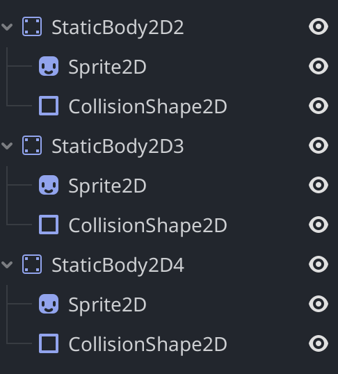
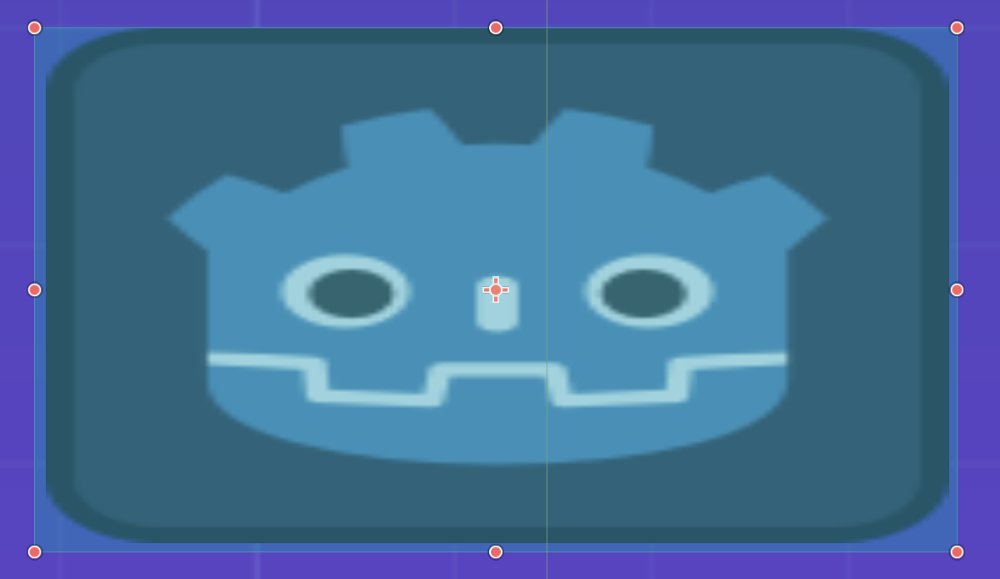
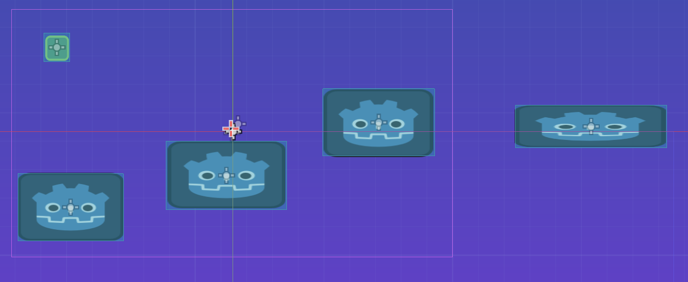
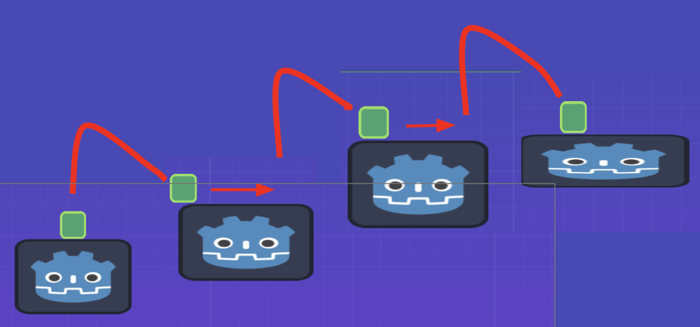

# Entry 2
##### 12/17/25

### Context
For the past month I have been learning how to use Godot. I am still on step 3 of the **Engineering Design Process** which is to brainstorm solutions.

### Learning my tool

#### Collisions and using assets
While learning Godot I wrote down everything I did into my [learning log](../tool/learning-log.md).

First I downloaded this starter [assest pack](https://github.com/gdquest-demos/godot-3-beginner-2d-platformer/releases/tag/1.1.0) for  2D platformer game.

I imported the assets into my Godot project by copying the files into the project folder.


I created a Node2D scene and added a characterBody2D node as a child node.

I added a sprite node as a child of the characterBody2D node and assigned the player image from the asset pack to it.

I also added a `CollisionShape2D` node as a child of the characterBody2D which is used to detect collisions with other objects. I set the shape of the collision to a rectangle that fits the player sprite.

Then just to center the camera on the player I added a `Camera2D` node as a child of the characterBody2D


I added a background by adding a sprite node as a child of the main scene and assigned the background image from the asset pack to it.


#### Player Movement
For this I had to use GDscript for the movement:

This is the full code I wrote today
```python
extends CharacterBody2D

const SPEED = 300.0
const JUMP_VELOCITY = -400.0

func _physics_process(delta: float) -> void:
    # Add gravity
    if not is_on_floor():
        velocity += get_gravity() * delta

    # Handle jump
    if Input.is_action_just_pressed("ui_accept") and is_on_floor():
        velocity.y = JUMP_VELOCITY

    # Get the input direction and handle movement/deceleration
    var direction := Input.get_axis("ui_left", "ui_right")
    if direction:
        velocity.x = direction * SPEED
    else:
        velocity.x = move_toward(velocity.x, 0, SPEED)

    move_and_slide()
```

`extends CharacterBody2D` means this script is attached to a CharacterBody2D node. It basically connects the code to my player character.

`const SPEED = 300.0` and `const JUMP_VELOCITY = -400.0` are constants that define the speed of the player and the jump velocity which is how high the player will jump. These values will be used later in the code to control the movement of the player.

The `_physics_process(delta: float) -> void:` function is a built-in function in Godot that is called every frame and is used for physics calculations.

The `delta` parameter represents the time passed since the last frame.

The way functions are defined in GDscript:
`nameOfFunction(parameter: type) -> returnType:`

The `_physics_process` is the name of the function.

The `(delta: float)` part indicates that this function takes one parameter called delta which is of type float.

A `float` is a number that can have decimal points.

The `-> void` part indicates that this function does not return any value.

In the `_physics_process` function we use an if statement to check if the player is not on the floor using the `is_on_floor()` method. If the player is in the air we add gravity to the player's velocity using `get_gravity()` multiplied by delta.

```python
    if not is_on_floor():
        velocity += get_gravity() * delta
```
The reason why we `+= velocity` is because we want to add the gravity to the current velocity of the player. This will make the player fall faster over time. Then by multiplying by `delta` we make sure the gravity is applied consistently regardless of the frame rate.

However when I tested the game the gravity did work but the player fell through the floor.


The way I fixed this was by creating a `CollisionShape2D` for the floor and player.

What a `CollisionShape2D` does is defines the shape of an object (in this case I used a rectangle shape for both the player and floor) for collision detection. This allows the physics engine to detect when two objects collide allowing the player to land on the floor instead of falling through it.


Lastly I added code to handle player jumping and horizontal movement.

The way inputs work in Godot is through the Input class. The Input class allows us to check for user input such as keyboard or mouse events.

For jumping I used an if statement to check if the jump button `ui_accept` (the space bar) is pressed AND if the player is on the floor. When both conditions are true we set the `velocity.y`(the vertical velocity of the player) to the `jump velocity` which makes the player jump.

```python
# if player presses jump button and is on the floor --> jump
    if Input.is_action_just_pressed("ui_accept") and is_on_floor():
        velocity.y = JUMP_VELOCITY
```

For horizontal movement I used the `Input.get_axis("ui_left", "ui_right")` method to get the input direction.

 This method returns a value between -1 and 1 based on the input from the left and right arrow keys. If the left arrow key is pressed it returns -1, if the right arrow key is pressed it returns 1, and if neither key is pressed it returns 0.

 I used an if statement to check if the direction is not 0 (meaning either left or right key is pressed). If a key is pressed we set the `velocity.x` (the horizontal velocity of the player) to the direction multiplied by the `SPEED` constant. This will move the player left or right based on the input.

 Then an else statement to stop the player from moving when no key is pressed. This is done using the `move_toward` method which gradually reduces the `velocity.x` to 0 at a rate of `SPEED`.

 How `move_toward' works:
 `move_toward(current_value, target_value, delta)`

 `delta` is how much to change the current value towards the target value.

```python
# get input direction
    var direction := Input.get_axis("ui_left", "ui_right")
    if direction:
        velocity.x = direction * SPEED
    else:
        velocity.x = move_toward(velocity.x, 0, SPEED)

    move_and_slide()
```

Finally we call the `move_and_slide()` to move the player based on its velocity and slides along any colliding surfaces.


Overall learned how to implement gravity, jumping, and horizontal movement for my player character using GDscript in Godot. I also learned how to add collision detection using CollisionShape2D nodes.

### Making a simple course

Like before I created StaticBody2D nodes for each platform and added CollisionShape2D nodes as children to define the shape of the platforms. I also added Sprite nodes as children to give the platforms its apperance.



For each collision shape I used a rectangle shape and adjusted its size to fit the platform sprite.



Here's how the level looks so far:



When I run the game the player can now jump on these platforms.




### Skills
### How to Read & How to Google
While learning my tool I have been using [Godot Docs](https://docs.godotengine.org/en/stable/). For example I used the [docs](https://docs.godotengine.org/en/stable/tutorials/physics/collision_shapes_2d.html) to learn about 2D collision shapes. I also found this [youtube video](https://www.youtube.com/watch?v=oED12Mo2018&t=742s) to help me with GDscript and it is where I found the assets for the game.

### Winter Break Plans
I will not have much time during winter break but I at least want to attempt to learn how to make consumable objects that the player can collect. If I have extra time I also want to learn how to make character animations.

[Previous](entry01.md) | [Next](entry03.md)

[Home](../README.md)
