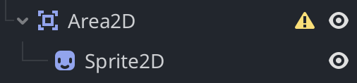
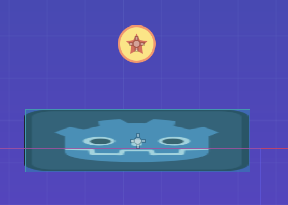
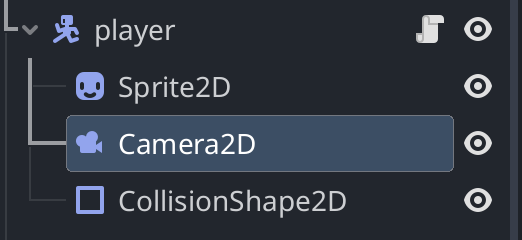
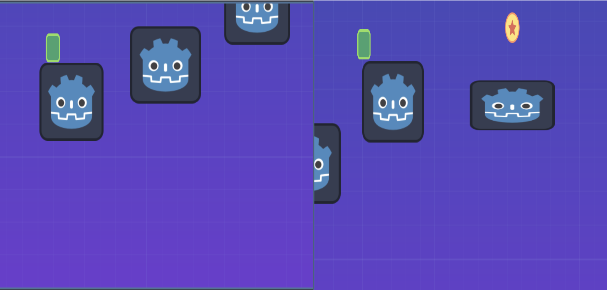

# Entry 3
##### 2/2/26

### Context
I had made a plan to continue learning my tool over winter break. I have not done much but here is what I got done so far.

### Learning Godot
I used this source to help me with learning my tool:
https://docs.godotengine.org/en/stable/tutorials/2d

#### Non-functioning coin:
So far I added created a coin but for now it can not be collected yet. I did this by making an Area2D which detects when another collision object enter, exit, or overlap with it.

Then I added a sprite to this Area2D to give it a physical appearance.

#### Tracking Camera:
I learned how to make the camera follow the player around.

To do this I just had to add a Camera2D node as a child of the player CharacterBody2D node.

Having the camera as a child of the player makes the camera follow the player around automatically. This is because child nodes inherit the position of their parent nodes.

When I run the game now the camera follows the player as it moves around the level.

This could be useful for my game since the level could be larger than the screen size and the player needs to see where they are going.

### The future and Engineering Design Process:
I will start moving on to the next step of the engineering design process which is to plan and build a prototype. I will make a plan for my project and then start building a prototype of my game. I will continue to learn how to use the tool and add more features to my game as I go along.

### Skills

The skills I improved on were **Embracing failure** and **How to Learn**

#### Embracing failure:
The failure I faced was not doing as much as I wanted to over winter break. I had a plan to learn a lot but I only got a little bit done. This was disappointing but I am not going to let it discourage me. I will keep on moving forward even if I set myself back a little.

#### How to Learn:
Simply practicing my tool and learning how to use it better is improving my ability to learn. I am learning how to learn new things and how to apply that knowledge to my project.

[Previous](entry02.md) | [Next](entry04.md)

[Home](../README.md)
