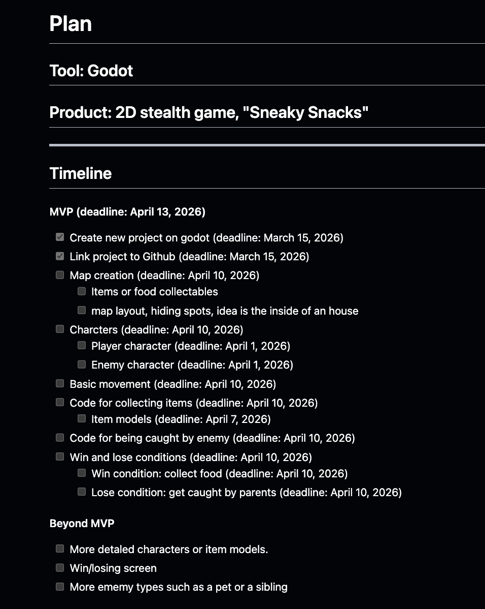
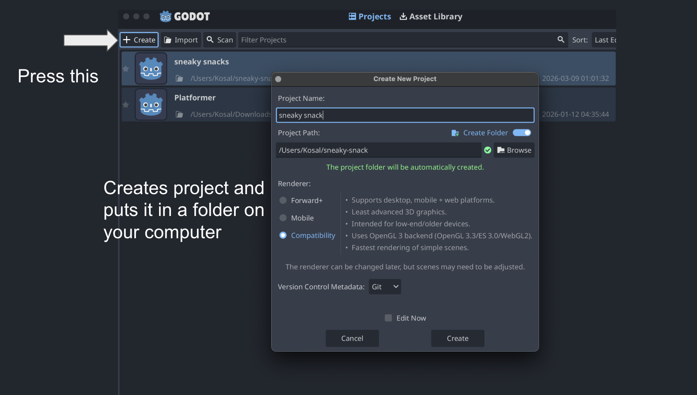
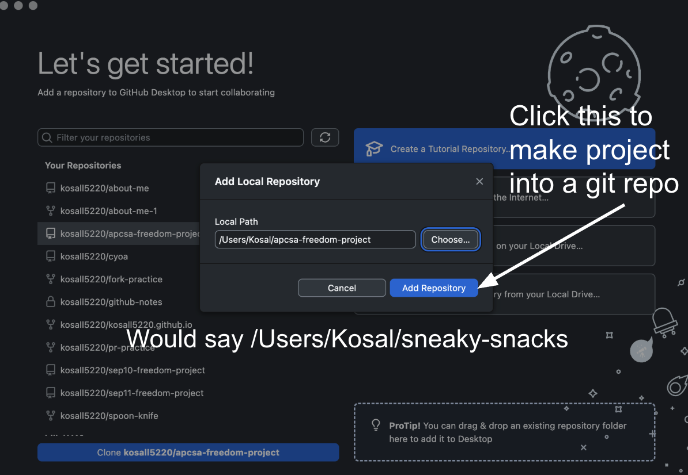
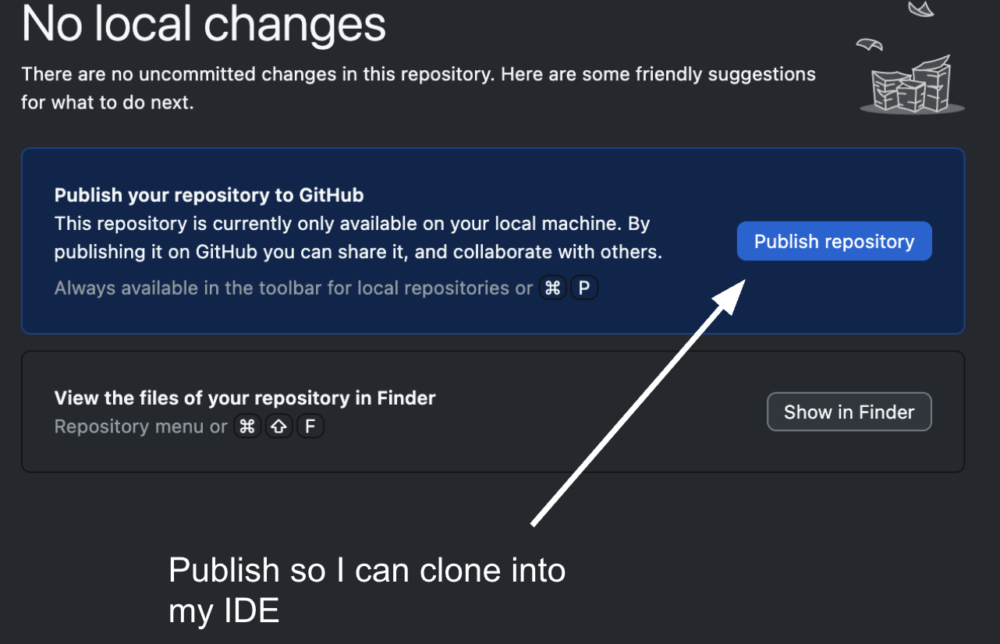
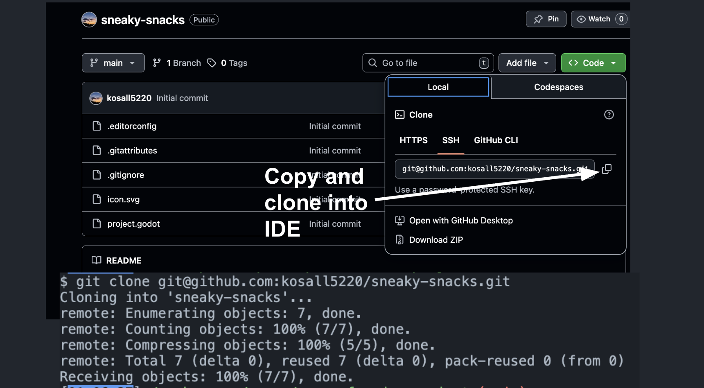

# Entry 4
##### 3/9/26

### Context
I continue to learn how to use Godot and started working on my freedom project.

### Engineering Design Process:
I am currently in the planning and prototyping stage of the engineering design process. I made a plan to complete the MVP of my project and also started working on it. I will continue to work on the MVP and then move on to the beyond MVP if I have time.

#### Making a plan:
For my plan I seperated each task and created a timeline for when I want each task to done. The goal is to finish everything before the due date which is April 13th, 2026.

My plan:

#### What I have done so far:
I started working on my freedom project a little bit. What I did was create a new project or game on Godot then linked it to Github.

First I had to create a new project on Godot.

Then to get it on github I had to download Github desktop and create a new repository for this project. After that I cloned the project folder into my IDE and opened it there.

Then I added the project files into the github destop app and turned it into a repository.

After that I published the repository to github and now I can see the project files on github.

Lastly I cloned the repository into my IDE and so I can now I can commit my edits to github.

My next steps are to start working on the map and charcters for the game. I also want to start working on the code for basic movement as well.

### Skills
The skills I have improved on were **problem decomposition** and **time management**.

#### Problem decomposition:
I broke down my project into smaller tasks and even had some subtasks for those bigger tasks. This made it easier to manage and also made it easier to know what I need to do for each task.

#### Time management:
I created a timeline for when I want each task to be done. This will help me stay on track and make sure I finish everything before the due date.

[Previous](entry03.md) | [Next](entry05.md)

[Home](../README.md)
