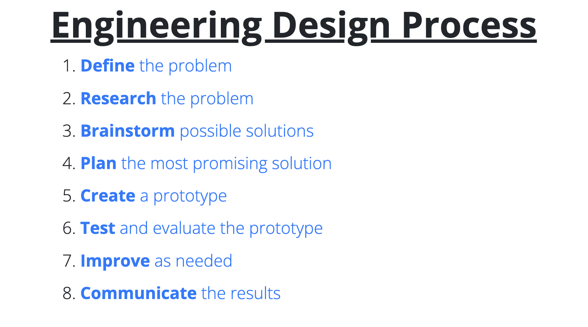
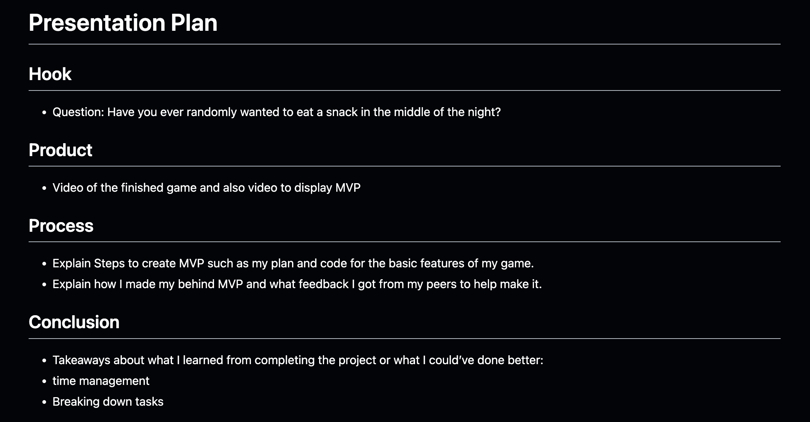
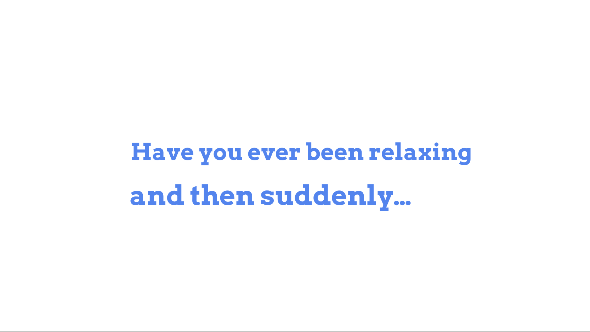
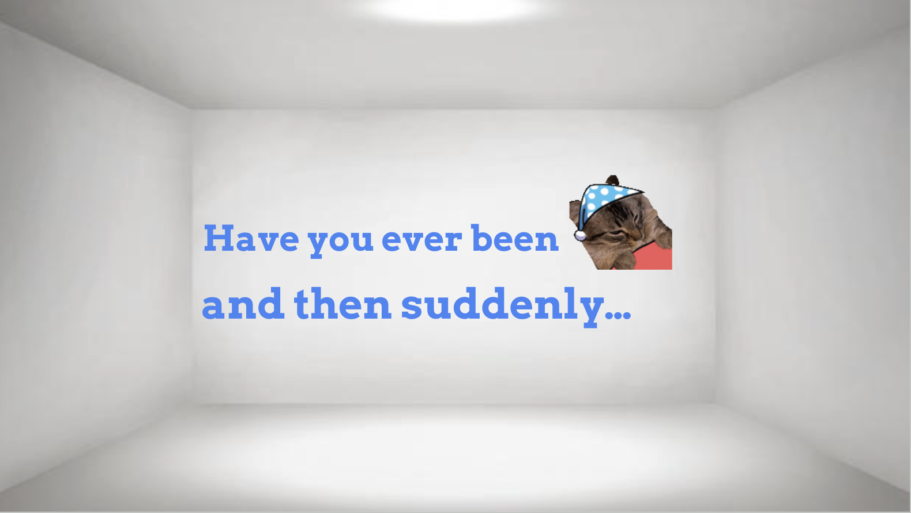
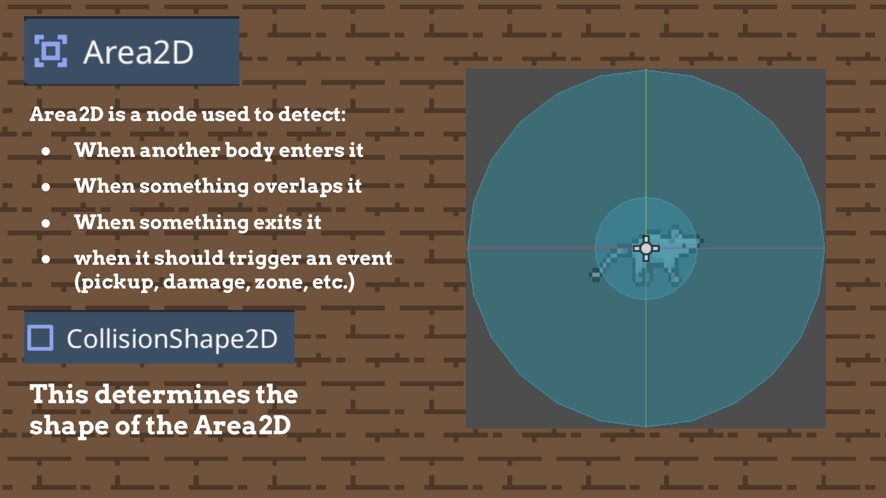

# Entry 6
##### 6/6/26

### Context
After finishing my final product I will now have to present it to my class and at the SEP expo.

### Engineering Design Process
I am now on the final step of the Engineering Design Process which is communicating your results.

### Making my Presentation

### Planning
The first thing I did before creating my slides was come up with a plan. In this plan I gave myself the general idea of what I wanted to accomplish.

### Creation
Similarly to what I did for my project I created an MVP. At the time most of the slides only had some text with a blank background behind it. If for some reason I couldn't finish everything on time at least I would have something to show.

###### Example Slide (MVP):

After setting up the basics of each slide I started decorating it. I decided to add images and change the background to all match the theme of my game.

###### Example Slide 1:

###### Example Slide 2:

### Class Presentation
For this year I picked the option to go last because I took a long time to complete my project. This was also my last ever presentation in my computer science class so I felt a lttle more nervous than normal.

For my hook I connected the late night cravings for snacks to my game.

Then I showed the class a video of the game and expalined all the features as it played. However I noticed that I was mostly staring at the laptop in front of me and I had to remind myself that I was in a classroom with other people listening.

I decided to take a small breather and I tried to recall all of the presentation skills I've learned over the years. After that, I corrected myself by making my voice louder and I focused on making more eye contact.

Over the course of my presentation my eye contact improved and my teacher even stated this in the feedback he gave me. I also got to press the button to submit all the final grades which I found cool!

My takeaways from the class presentation is that it's okay to take a moment to reset and to focus on your weaknesses which improving on something.

### SEP Expo Elevator Pitch
For the SEP Expo I decided to showcase my game to the judges by showing them a video of it. One regret I had was that I did not have a plan for this so when I spoke to the judges I wasn’t as confident in my words. I think they also wanted me to add more to my project, but overall my takeaway would be to spend more time preparing for presentations.

### Skills
The skills I learned from completing my presentations were **Communication** and **Consideration**

#### Communication
When presenting this project I had to find ways to catch the audiences attention and articulate my work clearly. To do this I had to correct myself by taking a short breather and I had to focus on previous weaknesses of mines such as eye contact and voice volume. I'm sure that focusing on these weaknesses during class presentations will improve my public speaking skills in the future.

#### Consideration
When creating my slides I tried to imagine myself as a member in the audience viewing it. This influenced my choices on how big the text should be or the color schemes of my slides. I had t be considerate about how my presentation would look like to everyone else.

### Takeaways
Once I finished going through all of my slides for the class presentation, I got to give some takeaways that I think are the most important lessons I learned from my time in SEP. These takeaways were:
#### Things won’t always go as planned
As a senior in high school there were a lot of events that pop up such as trips or AP tests. This took a lot of time away from my freedom project and it forced me to adjust. However I can admit that I did not do a great job with this and something I could have done better was focus on taking small steps instead of trying to do everything all at once.
#### Don’t worry about perfection
I remember while working on my game I had made a scene with a lot of detail but I still hadn't finished the core features of my game. As a result of this I became slightly behind on work and I remembered my teacher telling me to only focus on the important parts of my project and work on all the extra stuff later. If I had done this from the start I would of had way more time to finish everything else.
#### Time is very limited
From being a senior I realized how fast time can move. Time is a limited resources and any resource with a limited amound should be managed properly. Throughout the year I had to find a way to save time for both school work and outside of school activities. To do this I tried writing down everything I needed to do and I prioritize the tasks that with an earlier due date. I also used google tasks to set due dates and reminders for myself which prevented me from forgetting a task in all the clutter.
#### You’ll be okay
This was the most important lesson I learned. Throughout school students such as myself find ourselves really stressed out over things such as grades, college, or maybe deadlines. But, even though the path in front of me always seemed foggy I always ended up alright. The biggest thing I learned is that failure does not mean the end of the world and no matter what happens you will be okay.

[Previous](entry05.md) | [Next](entry07.md)

[Home](../README.md)
