# Tool Learning Log

## Tool: **Godot**

## Project: **"Sneaky Snacks"**

---

### 9/29/25:
* First thing I did was download Godot and import it into github. I did this by creating a new project on Godot then using Github desktop to add the project folder into a new repository and published it to github. Then I cloned the Godot repo into my Freedom Project folder in my IDE. I watch the video ["Godot 4 - How to use GitHub in less than 3 mins"](https://www.youtube.com/watch?v=qT8ut3EaIpM&t=4s) by CTG on Youtube to do this.

Now I need to start learning how to use Godot. I watched this [video](https://www.youtube.com/watch?v=G64gMZdWPv4) by nikich which is only part one of his Godot beginner tutorial.

First I learned the concept of scenes and nodes. Scenes are like a container to hold nodes. Nodes are the things stored in the scene. For example you can have a scene to represent a player character which would holds nodes for the appearnce of the character or the animations for it.

##### Example from video
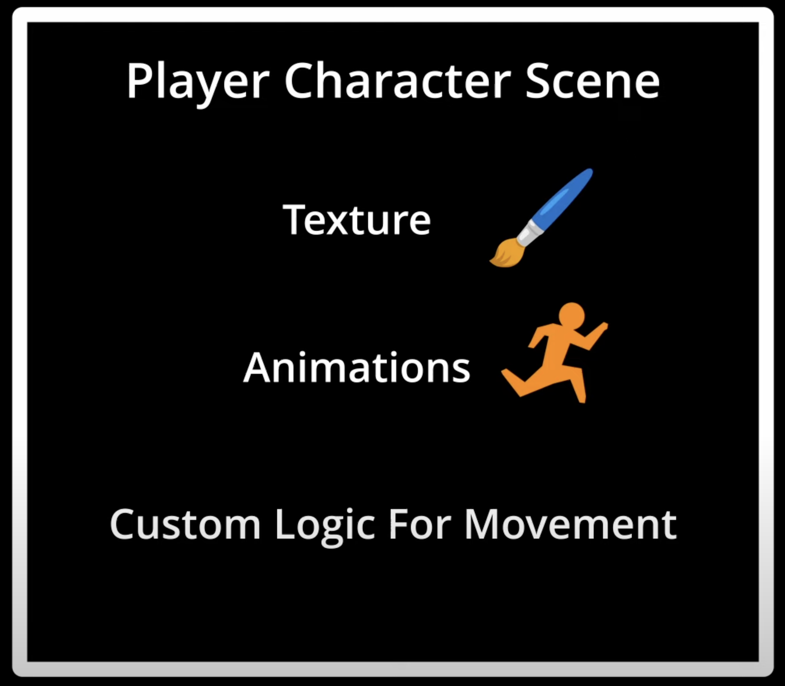

Speaking of characters I learned how to make a basic character.

First I created a new scene called main and then added a child node called player.

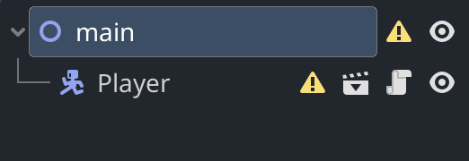

Then I created a asset folder and pasted an image that would represent the player charcter. I created a new sprite node as a child of the player node and assigned the image to it.

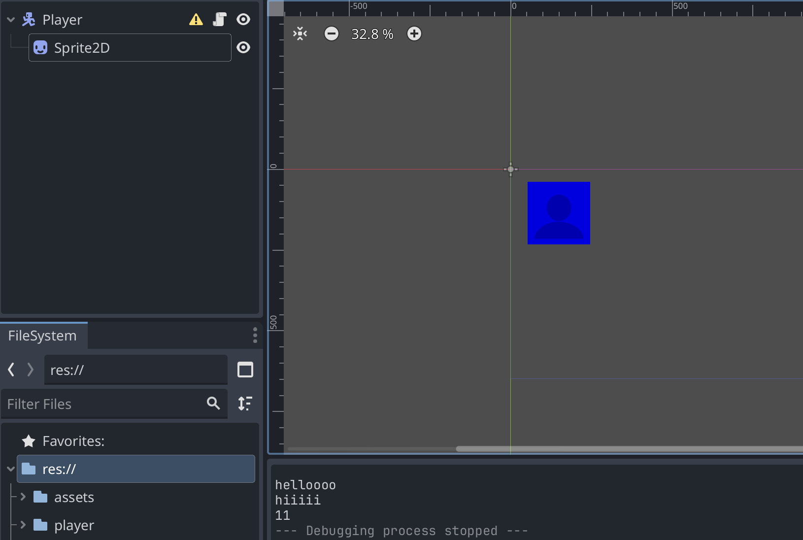

Now we have to write script to make the player move. But first I needed to learn GDscript.

GDscript is a programming language made for Godot and is similar to Python.

First I learned how to make variables and functions. Variables are used to store data and functions are used to group code together to be reused later.

```java
func _hello_world()->void: // void means this function does not return anything
    var my_variable = "Hello World" // Creates var
    print(my_variable) // prints var to console
```

The output of this code would be "Hello World" printed to the console.

It's also good to specify the type of data a variable will hold.

For numbers you can use int or float. Int is for whole numbers and float is for decimal numbers. And for words you can use String.

```Java
func _hello_world()->void: /
    var my_variable:String = "Hello World"
    print(my_variable)
```

Example of function with parameters and return type

```Java
func sum_numbers(num1:int, num2:int)->int: // the stuff in the () are parameters and the ->int means this function returns an int
	return num1 + num2

var result = sum_numbers(5, 10) // result will be 15

print(result)
```
How this works is when you call the function sum_numbers and pass in two numbers, it will add them together and return the result.

Now we will get the player model to move to the right side

First we need to understand how movement works on a 2d plane. On the x axis, moving right increases the x value and moving left decreases it. On the y axis it's different from what we learn in math class, moving down increases the y value and moving up decreases it.

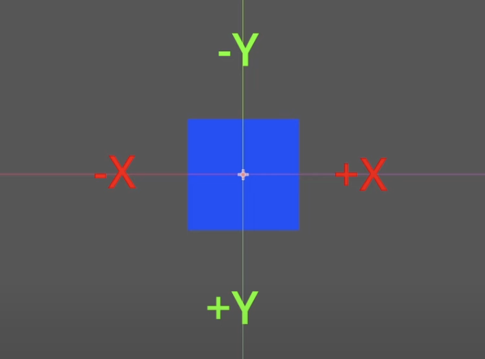

To move the player to the right I would have to increase the x value of the player node.

```Java
func _physics_process(delta: float) -> void:
	position.x+=50*delta // move right 50 pixels per second
    // same as position.x = position.x + 50*delta
```
The _physics_process is a built in function that runs every frame. The delta parameter is the time it took to complete the last frame. This is used to make sure the movement is consistent regardless of the frame rate.

The position variable is a built in variable that holds the position of the node. So by increasing the x value of the position variable, we are moving the player to the right.

If we wanted to move the player down we would increase the y value of the position variable.

```Java
func _physics_process(delta: float) -> void:
    position.y+=50*delta
```

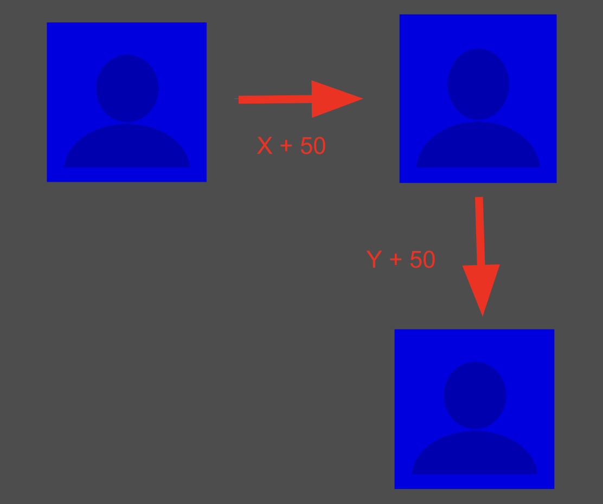

For today I just got some exposure to Godot and learned how to use GDScript to make a basic character model move. Later on I will explore more ways to use Godot.

### 11/1/25

For today I just learned how to put text or labels into my scene.

First I clicked this `+` button at the top left to add a new node.

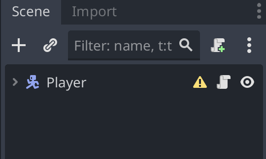

Then I searched for "Label" and added it to my scene as a child of the main node.

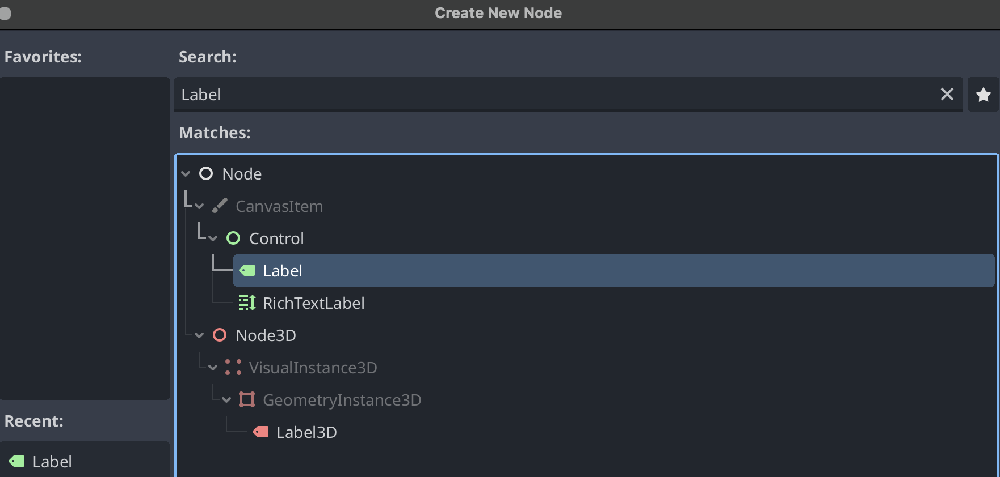

Now I can change the text of the label by selecting it and changing the "Text" property in the inspector on the right. For this I just changed it to "Hello World".

I also moved the label by clicking and dragging it in the scene view.


Lastly I changed the color of the text to green by editing the `Theme Property font_color` in the inspector.

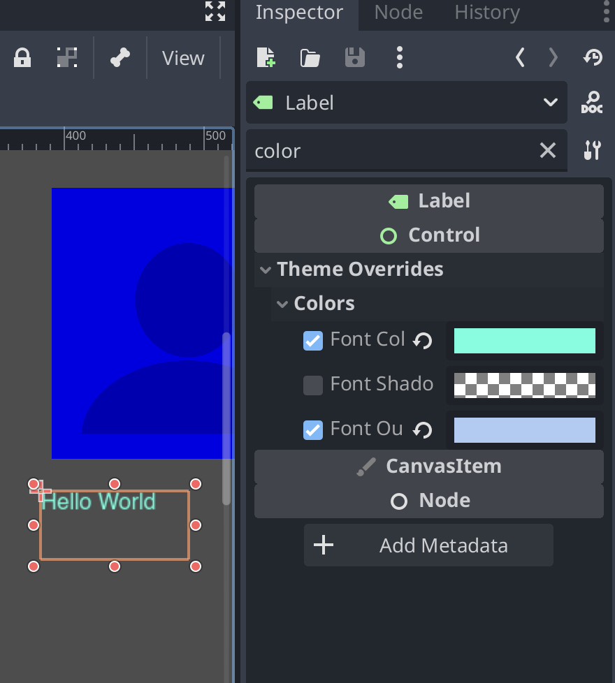

Today I didn't get to do too much and just learned how to add text to my scene. Hopefully I could explore some cooler features like building the background of a game or maybe having user input to move the player around.

### 11/11/2025

First I downloaded this starter [assest pack](https://github.com/gdquest-demos/godot-3-beginner-2d-platformer/releases/tag/1.1.0) for  2D platformer game.

I imported the assets into my Godot project by copying the files into the project folder.

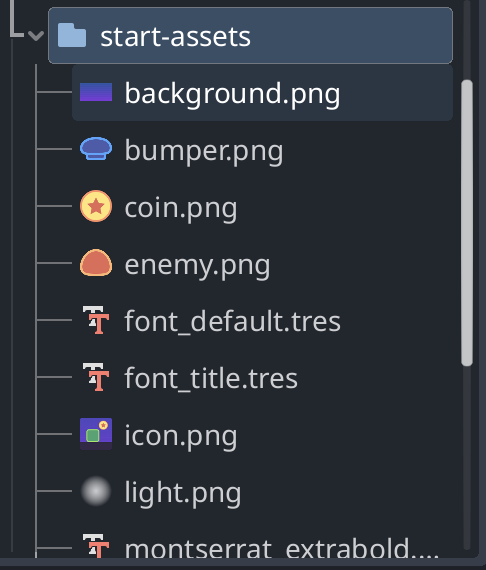

I created a Node2D scene and added a characterBody2D node as a child node.

I added a sprite node as a child of the characterBody2D node and assigned the player image from the asset pack to it.

I also added a `CollisionShape2D` node as a child of the characterBody2D which is used to detect collisions with other objects. I set the shape of the collision to a rectangle that fits the player sprite.

Then just to center the camera on the player I added a `Camera2D` node as a child of the characterBody2D

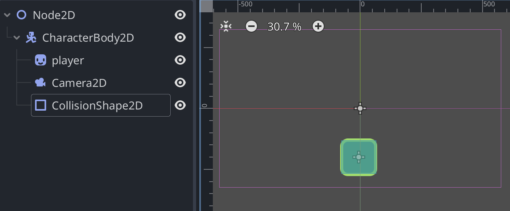

I added a background by adding a sprite node as a child of the main scene and assigned the background image from the asset pack to it.

For today I just created a charcter with collision detection and a background.

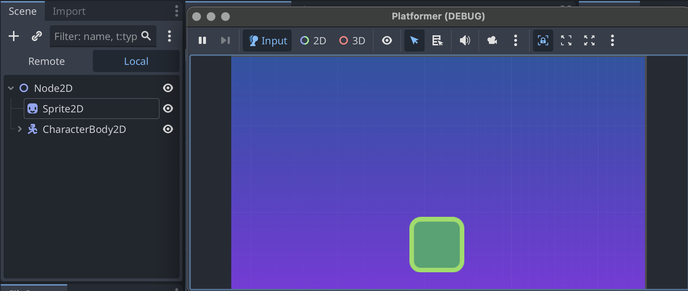

### 11/20/25:
Video I used for today: [How to Make a 2D Platformer in Godot - Coding With Russ](https://www.youtube.com/watch?v=oED12Mo2018&t=742s)

Today I learned about collisons and player movement.

For this I had to use GDscript for the movement:

This is the full code I wrote today
```python
extends CharacterBody2D

const SPEED = 300.0
const JUMP_VELOCITY = -400.0

func _physics_process(delta: float) -> void:
	# Add gravity
	if not is_on_floor():
		velocity += get_gravity() * delta

	# Handle jump
	if Input.is_action_just_pressed("ui_accept") and is_on_floor():
		velocity.y = JUMP_VELOCITY

	# Get the input direction and handle movement/deceleration
	var direction := Input.get_axis("ui_left", "ui_right")
	if direction:
		velocity.x = direction * SPEED
	else:
		velocity.x = move_toward(velocity.x, 0, SPEED)

	move_and_slide()
```

`extends CharacterBody2D` means this script is attached to a CharacterBody2D node. It basically connects the code to my player character.

`const SPEED = 300.0` and `const JUMP_VELOCITY = -400.0` are constants that define the speed of the player and the jump velocity which is how high the player will jump. These values will be used later in the code to control the movement of the player.

The `_physics_process(delta: float) -> void:` function is a built-in function in Godot that is called every frame and is used for physics calculations.

The `delta` parameter represents the time passed since the last frame.

The way functions are defined in GDscript:
`nameOfFunction(parameter: type) -> returnType:`

The `_physics_process` is the name of the function.

The `(delta: float)` part indicates that this function takes one parameter called delta which is of type float.

A `float` is a number that can have decimal points.

The `-> void` part indicates that this function does not return any value.

In the `_physics_process` function we use an if statement to check if the player is not on the floor using the `is_on_floor()` method. If the player is in the air we add gravity to the player's velocity using `get_gravity()` multiplied by delta.

```python
    if not is_on_floor():
        velocity += get_gravity() * delta
```
The reason why we `+= velocity` is because we want to add the gravity to the current velocity of the player. This will make the player fall faster over time. Then by multiplying by `delta` we make sure the gravity is applied consistently regardless of the frame rate.

However when I tested the game the gravity did work but the player fell through the floor.

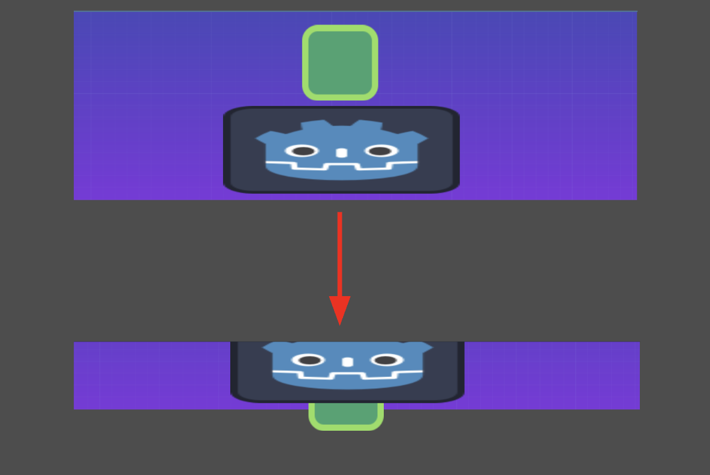

The way I fixed this was by creating a `CollisionShape2D` for the floor and player.

What a `CollisionShape2D` does is defines the shape of an object (in this case I used a rectangle shape for both the player and floor) for collision detection. This allows the physics engine to detect when two objects collide allowing the player to land on the floor instead of falling through it.

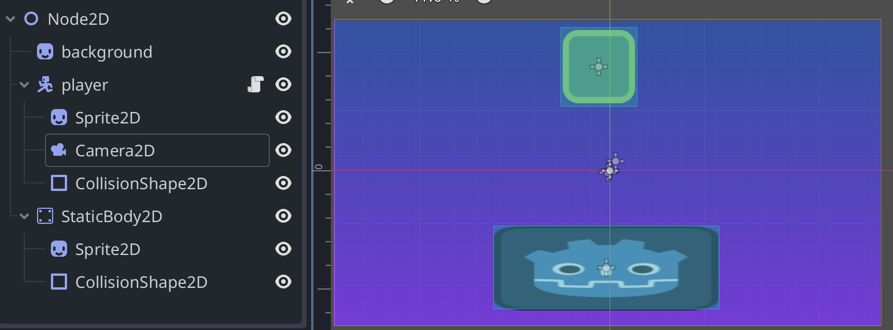

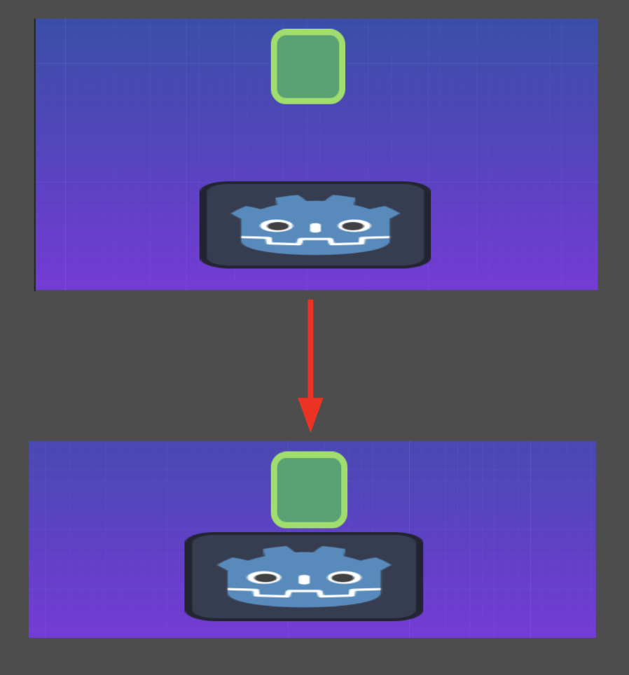

Lastly I added code to handle player jumping and horizontal movement.

The way inputs work in Godot is through the Input class. The Input class allows us to check for user input such as keyboard or mouse events.

For jumping I used an if statement to check if the jump button `ui_accept` (the space bar) is pressed AND if the player is on the floor. When both conditions are true we set the `velocity.y`(the vertical velocity of the player) to the `jump velocity` which makes the player jump.

```python
# if player presses jump button and is on the floor --> jump
    if Input.is_action_just_pressed("ui_accept") and is_on_floor():
        velocity.y = JUMP_VELOCITY
```

For horizontal movement I used the `Input.get_axis("ui_left", "ui_right")` method to get the input direction.

 This method returns a value between -1 and 1 based on the input from the left and right arrow keys. If the left arrow key is pressed it returns -1, if the right arrow key is pressed it returns 1, and if neither key is pressed it returns 0.

 I used an if statement to check if the direction is not 0 (meaning either left or right key is pressed). If a key is pressed we set the `velocity.x` (the horizontal velocity of the player) to the direction multiplied by the `SPEED` constant. This will move the player left or right based on the input.

 Then an else statement to stop the player from moving when no key is pressed. This is done using the `move_toward` method which gradually reduces the `velocity.x` to 0 at a rate of `SPEED`.

 How `move_toward' works:
 `move_toward(current_value, target_value, delta)`

 `delta` is how much to change the current value towards the target value.

```python
# get input direction
    var direction := Input.get_axis("ui_left", "ui_right")
    if direction:
        velocity.x = direction * SPEED
    else:
        velocity.x = move_toward(velocity.x, 0, SPEED)

    move_and_slide()
```

Finally we call the `move_and_slide()` to move the player based on its velocity and slides along any colliding surfaces.


Overall today I learned how to implement gravity, jumping, and horizontal movement for my player character using GDscript in Godot. I also learned how to add collision detection using CollisionShape2D nodes.

I hope to find more features in Godot that I could use to help with my Freedom Project game.

<!--
* Links you used today (websites, videos, etc)
* Things you tried, progress you made, etc
* Challenges, a-ha moments, etc
* Questions you still have
* What you're going to try next
-->
